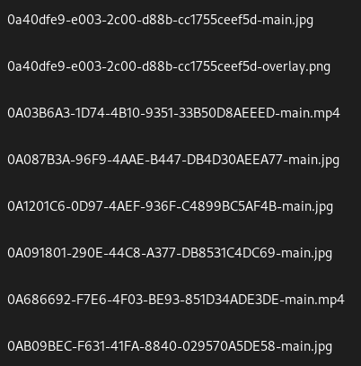
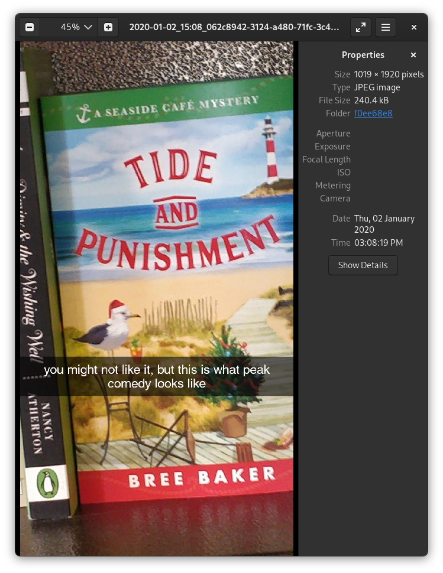

# SnapchatMemoriesMetadataAdder


Adds metadata (captions and timestamps) to your exported Snapchat memories.

## Background
Snapchat allows you to save images/videos to their servers with their memories
feature. When you export your memories from Snapchat [from their accounts
website](https://accounts.snapchat.com), you get all the memories, but with no
metadata and the captions are stored separately!



| Base Image | Overlay Image |
| ---------- | ------------- |
|  |  |

You may then go to an alternate project like [ToTheMax's
Snapchat-All-Memories-Downloader](https://github.com/ToTheMax/Snapchat-All-Memories-Downloader),
which is fantastic! It uses a `memories_history.json` file to download all memories and add a timestamp, but this technique loses all the captions! They aren't included in `memories_history.json` :(

```json
{
  "Date": "2020-01-02 23:08:19 UTC",
  "Media Type": "Image",
  "Location": "Latitude, Longitude: 0.0, 0.0",
  "Download Link": "https://app.snapchat.com/dmd/memories?..."
}
```
So in short, `memories_history.json` has all the metadata we need, but we need
to combine it with the full memory export if we want captions.  So this project
serves as a bridge between these two methods! We have all the metadata and we
have all the memory photos/videos and captions, we just need to combine them. The final result:



Note the caption is on the image, the file name and metadata has a timestamp!
The file's creation date is also set to the correct date.

## Install

This project relies on two major libraries.

- [ffmpeg](https://ffmpeg.org/) is "a complete, cross-platform solution to
  record, convert and stream audio and video." This project uses it to overlay
  the captions onto videos. Download it from your package manager if you're on
  Linux or [download a compiled version here](https://ffmpeg.org/download.html).
- [libvips](https://www.libvips.org/) is "a demand-driven, horizontally threaded
  image processing library. Compared to similar libraries, libvips runs quickly
  and uses little memory." This project uses it to overlay the captions onto
  images. Download it from your package manager if you're on Linux or [download
  a compiled version here and add it to your
  path](https://www.libvips.org/install.html).

Finally, this project requires [Python](https://www.python.org/) to be installed
on your computer. Once installed, you can clone this repo and run

```shell
python -m pip install -r requirements.txt
```

to install the Python requirements for the project.

## Usage

First, we need to get our data.

- [Follow Snapchat's instructions to download your
  data](https://help.snapchat.com/hc/en-gb/articles/7012305371156), making sure
  to "Include your memories as a downloadable file" and put no date range to
  get all memories! Wait for an email and download when ready. (Note: this may
  take up a significant amount of space!) If you get multiple zip files, merge
  all the `memories` folders into one `memories` folder. This is the only folder
  you need.
- Next, request your data again, but *do not* include your memories. This
  should be much quicker :) In this data export, make sure you have a
  `json/memories_history.json`. This is the metadata for the memories.

Now, make a folder in this repo called `input` and put the `memories` folder
from the first export and the `memories_history.json` file from the second
export into it.
  - Alternatively, you can provide the location of the `memories_history.json`
file with the `--memories-history` flag and the memories folder with the
`memories` flag, for example `python main.py --memories-history test/
memories_history.json --memories-folder test/memories --output test_output`.

With this folder prepared, you can now run `python main.py` to run the script!
It will create a new folder called `output` that will hold all memories with
timestamps and captions. (Note: this will create a new copy of each photo/video,
so make sure you have enough space!) Alternatively, use the `--output` flag to
provide a different location to dump the photos.

## Contributing

This achieved what I needed it to do, so I don't anticipate adding many more
features. I'd be happy to accept PRs for some feaures I didn't implement:

- Cleaning the project up :) Introducing python-ffmpeg's async definitely made
  this functional but messy.
- Inserting location metadata into the final photos. The locations are parsed,
  they just aren't added to the photos. You'll need to find the proper EXIF
  tags.
- Snapchat uses UTC as the timezone for the timestamps. This script takes a
  guess that your computer's local time zone is the timezone you want the
  timestamps in. Allowing the user to specify a timezone, or automatically
  determine the timezone from the photo's location data, would be an
  improvement.
- I believe [ffmpeg could also do photos, but it's less efficient than
  VIPS](https://stackoverflow.com/questions/70966770/ffmpeg-or-imagemagick-for-image-conversion-and-resizing-speed-memory-usage).
  Adding a fallback to ffmpeg would make installation easier for those who
  can't easily install VIPS.

## License
MIT