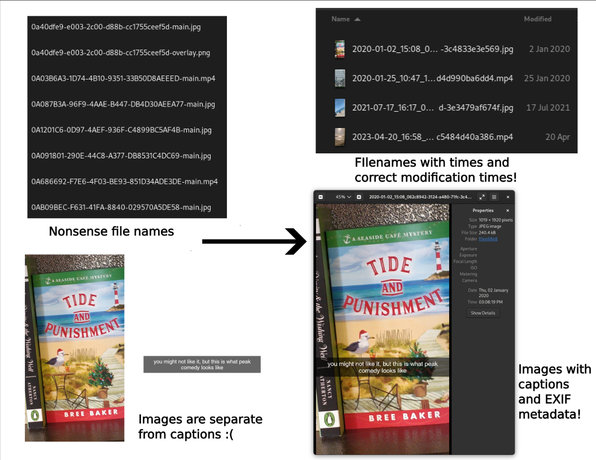

# SnapchatMemoriesCaptionAdder



Adds metadata (captions and timestamps) to your exported Snapchat memories.

## Background
Snapchat allows you to save images/videos to their servers with their memories
feature. When you export your memories from Snapchat [from their accounts
website](https://accounts.snapchat.com), you get all the memories, but with no
metadata and the captions are stored separately!


| Base Image | Overlay Image |
| ---------- | ------------- |
|  |  |

You may then go to an alternate project like [ToTheMax's
Snapchat-All-Memories-Downloader](https://github.com/ToTheMax/Snapchat-All-Memories-Downloader),
which is fantastic! It uses a `memories_history.json` file to download all memories and add a timestamp, but this technique loses all the captions! They aren't included in `memories_history.json` :(

```json
{
  "Date": "2020-01-02 23:08:19 UTC",
  "Media Type": "Image",
  "Location": "Latitude, Longitude: 0.0, 0.0",
  "Download Link": "https://app.snapchat.com/dmd/memories?..."
}
```
So in short, `memories_history.json` has all the metadata we need, but we need
to combine it with the full memory export if we want captions.  So this project
serves as a bridge between these two methods! We have all the metadata and we
have all the memory photos/videos and captions, we just need to combine them. The final result:


Note the caption is on the image, the file name and metadata has a timestamp!
The file's creation date is also set to the correct date.

## Install

> [!NOTE]  
> This project and documentation is not very friendly to non-developers :( If
> you have questions, I'm happy to try and help if you make a new Github issue.
> I'm very open to any PRs that want to work on making this more user-friendly
> (see the Contribution section below!)

This project relies on two major libraries.

- [ffmpeg](https://ffmpeg.org/) is "a complete, cross-platform solution to
  record, convert and stream audio and video." This project uses it to overlay
  the captions onto videos. If you're on Linux, download it from your package
  manager, if you're on MacOS, install it from
  [brew](https://formulae.brew.sh/formula/ffmpeg), and if you're on Windows,
  install it from
  [winget](https://learn.microsoft.com/en-us/windows/package-manager/winget/)
  (package [here](https://winget.run/pkg/Gyan/FFmpeg)).
- [libvips](https://www.libvips.org/) is "a demand-driven, horizontally threaded
  image processing library. Compared to similar libraries, libvips runs quickly
  and uses little memory." This project uses it to overlay the captions onto
  images. If you're on Linux, download it from your package manager, if you're
  on macOS install it from [brew](https://formulae.brew.sh/formula/vips), and if
  you're on Windows [download a compiled version
  here](https://www.libvips.org/install.html#installing-the-windows-binary) and
  [add the bin folder to your
  path](https://stackoverflow.com/q/44272416).

Finally, this project requires [Python](https://www.python.org/) to be installed
on your computer. Once installed, you can clone this repo and run

```shell
python -m pip install -r requirements.txt
```

to install the Python requirements for the project.

## Usage

> [!NOTE]  
> This project and documentation is not very friendly to non-developers :( If
> you have questions, I'm happy to try and help if you make a new Github issue.
> I'm very open to any PRs that want to work on making this more user-friendly
> (see the Contribution section below!)

First, we need to get our data. [Follow Snapchat's instructions to download your
data](https://help.snapchat.com/hc/en-us/articles/7012305371156). You'll need to
do two separate exports:

- Check "Include your Memories, Chat Media and Shared Stories" to download all
  your memories. (Note: this may take up a significant amount of space!) The
  status of the other checkmarks shouldn't matter, so feel free to export any
  additional data you'd like. Make sure the date range includes everything you
  want to export! If you choose to download multiple data packages, merge all
  the `memories` folders into one `memories` folder. This is the only folder you
  need from the export for this script.
  
- Create a second export, *without* "Include your Memories, Chat Media and
  Shared Stories" checked, and *with* "Export JSON files" and "Memories and
  Other Media" checked. Use the same date range as your first export. This
  export should take much less time for Snapchat to send to you :) In this
  data export, make sure you have a `json/memories_history.json`. This is the
  metadata for the memories, which is only generated when you *don't* export
  your memories.

Now, make a folder in this repo called `input` and put the `memories` folder
from the first export and the `memories_history.json` file from the second
export into it.
  - Alternatively, you can provide the location of the `memories_history.json`
    file with the `--memories-history` flag and the memories folder with the
    `memories` flag, for example `python main.py --memories-history
    test/memories_history.json --memories-folder test/memories --output
    test_output`.

With this folder prepared, you can now run `python main.py` to run the script!
It will create a new folder called `output` that will hold all memories with
timestamps and captions. (Note: this will create a new copy of each photo/video,
so make sure you have enough space!) Alternatively, use the `--output` flag to
provide a different location to dump the photos.

If you run into issues, please run the script with the `-v` or `--verbose`
flag, which will output information on what the script is doing. If that
doesn't help you with the issue, open a github issue with that output! You
can also use the `-vv` flag to get logs from ffmpeg/vips.

Some other flags:
- `--image-only` will only convert images and not videos!
- `--video-only` will only convert videos and not images!
- `--only-one` will only convert one video and one image - useful for debugging
  to see the log of only one conversion, or testing the script before running
  it on your entire library.

> [!WARNING]
> If your captions are important to you, double check the final result against
> the photos in the Snapchat app! I found that the memories export did not
> include overlays/captions from some of my photos in 2017-2018. So check the
> final photos to make sure captions are there. If they aren't, you may need
> to download those impacted photos/videos directly from the Snapchat app.
> The majority of photos were successfully exported with all their captions.

Note: The timezone applied to the photos is set by your computer's local
timezone! I'm open to any PRs to improve this (see below), but for a quick
hack you can set the default timezone in SnapchatMemoriesCaptionAdder/adder.py
in the `add_metadata` signature.

## Thanks
- [@n-katti](https://github.com/n-katti) for fixing issues on Windows and new Snapchat export format (issue #3)
- [@Enricon27](https://github.com/Enricone27) for fixing a problem with the earlier fix :) (issue #3)
- [@autumnesponda](https://github.com/autumnesponda) for adding location metadata

## Contributing

This achieved what I needed it to do, so I don't anticipate adding many more
features. I'd be happy to accept PRs for some feaures I didn't implement:

- **Making this much more user friendly.** This is currently not accessible to
  anyone who doesn't have knowledge of installing and using libraries.
    - Bundling libraries with the app
    - Creating a GUI
- Cleaning the project up :) Introducing python-ffmpeg's async definitely made
  this functional but messy.
- Snapchat uses UTC as the timezone for the timestamps. This script takes a
  guess that your computer's local time zone is the timezone you want the
  timestamps in. Allowing the user to specify a timezone, or automatically
  determine the timezone from the photo's location data, would be an
  improvement.
- I believe [ffmpeg could also do photos, but it's less efficient than
  VIPS](https://stackoverflow.com/questions/70966770/ffmpeg-or-imagemagick-for-image-conversion-and-resizing-speed-memory-usage).
  Adding a fallback to ffmpeg would make installation easier for those who
  can't easily install VIPS.

## License
MIT
