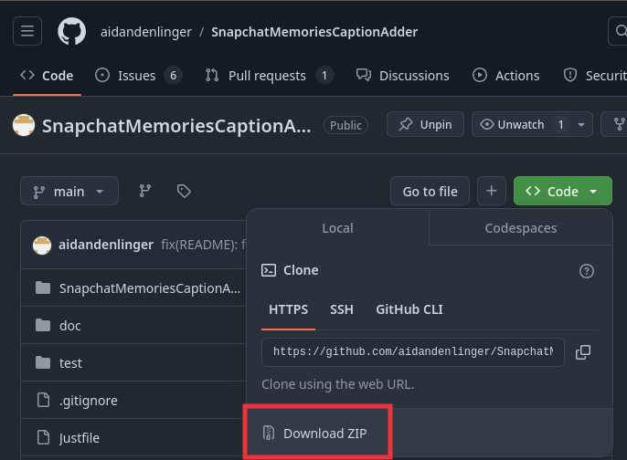
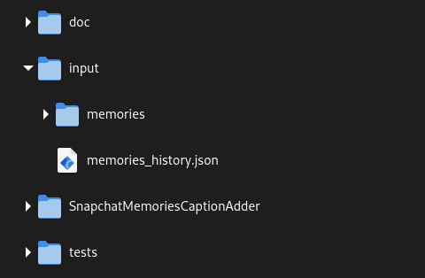

# SnapchatMemoriesCaptionAdder


Adds metadata (captions, timestamps and location) to your exported Snapchat memories.

## Background
Snapchat allows you to save images/videos to their servers with their memories
feature. When you export your memories from Snapchat [from their accounts
website](https://accounts.snapchat.com), you get all the memories, but with no
metadata (date/time/location) and the captions are stored separately!


| Base Image | Overlay Image |
| ---------- | ------------- |
|  |  |

Alternate projects like [ToTheMax's
Snapchat-All-Memories-Downloader](https://github.com/ToTheMax/Snapchat-All-Memories-Downloader),
do not include captions. (Although if you don't need captions, ToTheMax's project is great!)

```json
{
  "Date": "2020-01-02 23:08:19 UTC",
  "Media Type": "Image",
  "Location": "Latitude, Longitude: 0.0, 0.0",
  "Download Link": "https://app.snapchat.com/dmd/memories?..."
}
```
So we have the images, metadata, and captions, they're just split up. This
project combines them into one photo, like Snapchat does. The final result:


## Install

> [!NOTE]
> This project and documentation is not very friendly to non-developers :( If
> you have questions, I'm happy to try and help if you make a new Github issue.
> I'm very open to any PRs that want to work on making this more user-friendly
> (see the Contribution section below!)

### Getting Your Snapchat Data

First, we need to get our Snapchat data. [Follow Snapchat's instructions to download your
data](https://help.snapchat.com/hc/en-us/articles/7012305371156). You'll need to
do two separate exports:

- Check "Include your Memories, Chat Media and Shared Stories" to download all
  your memories. (Note: this may take up a significant amount of space!) The
  status of the other checkmarks shouldn't matter, so feel free to export any
  additional data you'd like. Make sure the date range includes everything you
  want to export! If you choose to download multiple data packages, merge all
  the `memories` folders into one `memories` folder. This is the only folder you
  need from the export for this script.
  
- Create a second export, *without* "Include your Memories, Chat Media and
  Shared Stories" checked, and *with* "Export JSON files" and "Memories and
  Other Media" checked. Use the same date range as your first export. This
  export should take much less time for Snapchat to send to you :) In this
  data export, make sure you have a `json/memories_history.json`. This is the
  metadata for the memories, which is only generated when you *don't* export
  your memories.

### Dependencies

This project requires you to install Python and two libraries. You'll also be
running commands from the terminal/Powershell.

#### Python
This project is written in Python, so it requires the [Python programming
language](https://www.python.org/) to be installed on your computer to run.

#### ffmpeg
[ffmpeg](https://ffmpeg.org/) is "a complete, cross-platform solution to record,
convert and stream audio and video." This project uses ffmpeg to overlay the
captions onto videos.

- Windows: Install it from
  [winget](https://learn.microsoft.com/en-us/windows/package-manager/winget/)
  with `winget install -e --id Gyan.FFmpeg` (package
  [here](https://winget.run/pkg/Gyan/FFmpeg)).  

- MacOS:  install `ffmpeg` from [brew](https://formulae.brew.sh/formula/ffmpeg).
  
- Linux: download `ffmpeg` from your package manager.

> [!NOTE]
> Linux users, please note ffmpeg must be version 7.1 or higher. FFmpeg 7 is
> *not* supported, because the scale2ref filter is broken on that version but
> the scale filter didn't yet support relative heights.
> [Ffmpeg 6 is not actively supported, but here's the last tag that supported it if that works for your environment](https://github.com/aidandenlinger/SnapchatMemoriesCaptionAdder/releases/tag/ffmpeg-6).
> If your distro doesn't provide ffmpeg 7, consider using
> [distrobox](https://github.com/89luca89/distrobox/tree/main) to spin up an
> Arch Linux container and run this script there.

#### libvips
[libvips](https://www.libvips.org/) is "a demand-driven, horizontally threaded
image processing library. Compared to similar libraries, libvips runs quickly
and uses little memory." This project uses it to overlay the captions onto
images.
  
- Windows:  [download a compiled version
here](https://www.libvips.org/install.html#installing-the-windows-binary) and
[add the bin folder to your
path](https://stackoverflow.com/q/44272416).

- MacOS: install it from [brew](https://formulae.brew.sh/formula/vips).

- Linux: Download it from your package manager.


#### Python Dependencies
Once you have Python, ffmpeg, and libvips installed, you can clone the repo
with `git`, or if you don't have `git` you can download the repo by clicking the
green `Code` button in the top right, and clicking Download ZIP:



Now open your terminal or Powershell and change directory to the repo. If you're unfamiliar
with the terminal, use the [Drag-and-Drop shortcut](https://www.cs.cornell.edu/courses/cs1110/2021sp/resources/shell-windows.html#drag-and-drop-windows):

- type in `cd`
- drag and drop the repo folder
- hit Enter

Then, run

```shell
python -m pip install -r requirements.txt
```

to install the Python requirements for the project. Okay, you're done with the install
process!

## Usage

> [!NOTE]
> This project and documentation is not very friendly to non-developers :( If
> you have questions, I'm happy to try and help if you make a new Github issue.
> I'm very open to any PRs that want to work on making this more user-friendly
> (see the Contribution section below!)

Now, make a folder in this repo called `input` and put the `memories` folder
from the first export and the `memories_history.json` file from the second
export into it. It should look like this:



Now, in your terminal/Powershell, run

```bash
python main.py
```

to run the program! It will create a new folder called `output` that will hold
all the memories with timestamps and captions.

> [!WARNING]
> If your captions are important to you, double check the final result against
> the photos in the Snapchat app! I found that the memories export did not
> include overlays/captions from some of my photos in 2017-2018. If captions
> are missing from some photos, you should download those impacted photos/videos
> directly from the Snapchat app.

> [!NOTE]
> The timezone applied to the photos is set by your computer's timezone.
> I'm open to any PRs to improve this (see the Collaboration section), ideally by
> determining the time zone from the latitude/longitude of the photo.

### Command Line Flags

You can change how the program runs with command line flags. You can see all
of them by running `python main.py --help`. These are only recommended if you're
familiar with the terminal. Here's a quick example that uses them, again see
`python main.py --help` for an explanation of what they do.

```bash
python main.py \
  -vv \
  --memories-history tests/memories_history.json \
  --memories-folder tests/memories \
  --output test_output \
  --video-only
```

This uses a different location for `memory_history.json`/the memories folder,
sets a different folder to output them, uses `-vv` to print every debugging
message (you can also use `-v` for less messages), and only converts videos
(there's also an `--image-only` flag).

### Running Tests

If you run into issues, try running the tests to see if they produce the
expected output. You can do this by running `just test` if you have
[just] installed, or by running `python -m unittest tests/test.py`.
The tests will have output files in `tests/output`, and there should be four.
There should be an image with no caption, an image with a caption, a video
with no caption, and a video with a caption. If there are issues with the
images, check your VIPS installation, and if there are issues with the videos,
check your ffmpeg installation.

If there are still issues, please run the script with the `-v` or `--verbose`
flag, which will output information on what the script is doing. If that
doesn't help you with the issue, open a github issue with that output! You
can also use the `-vv` flag to get logs from ffmpeg/vips.


## Thanks
- [@n-katti](https://github.com/n-katti) for fixing issues on Windows and new Snapchat export format (issue [#3](https://github.com/aidandenlinger/SnapchatMemoriesCaptionAdder/issues/3))
- [@Enricon27](https://github.com/Enricone27) for fixing a problem with the earlier fix :) (issue [#3](https://github.com/aidandenlinger/SnapchatMemoriesCaptionAdder/issues/3))
- [@autumnesponda](https://github.com/autumnesponda) for adding location metadata
- [@harrydayexe](https://github.com/harrydayexe) for adding FFMPEG 7.1 support (issue [#7](https://github.com/aidandenlinger/SnapchatMemoriesCaptionAdder/issues/7) and [#14](https://github.com/aidandenlinger/SnapchatMemoriesCaptionAdder/issues/14))

## Contributing

This achieved what I needed it to do, so I don't anticipate adding many more
features. I'd be happy to accept PRs for some feaures I didn't implement:

- **Making this much more user friendly.** This is currently not accessible to
  anyone who doesn't have knowledge of installing and using libraries.
    - Bundling libraries with the app
    - Creating a GUI
- Cleaning the project up :) Introducing python-ffmpeg's async definitely made
  this functional but messy.
- Snapchat uses UTC as the timezone for the timestamps. This script takes a
  guess that your computer's local time zone is the timezone you want the
  timestamps in. Allowing the user to specify a timezone, or automatically
  determine the timezone from the photo's location data, would be an
  improvement.
- I believe [ffmpeg could also do photos, but it's less efficient than
  VIPS](https://stackoverflow.com/questions/70966770/ffmpeg-or-imagemagick-for-image-conversion-and-resizing-speed-memory-usage).
  Adding a fallback to ffmpeg would make installation easier for those who
  can't easily install VIPS.

## License
MIT
